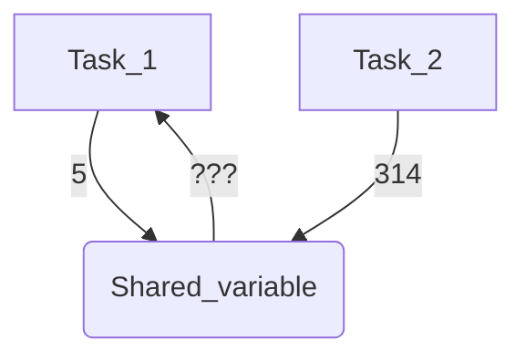

# Why learn rust?

## Memory safety

> Rust takes memory safety *really* seriously

- Other languages
    - Managing memory is the **programmer's** responsibility
    - Include a garbage collector that nerfs the programmer's ability to make memory-related optimizations
- Rust's approach
    - The *ownership system* and *borrow checker* help the programmer avoid common errors
    - Can be challenging to get used to (compared to other languages)

### Handling memory (tradition)

- Programmer is given *a lot* of freedom to manage memory
- This freedom makes it easy to introduce errors like
    - Forgetting to release unused memory
    - Accidently accessing the wrong part of memory

### The ownership system

> Every piece of data has an *owner*

- Owners are variables
- When a variable falls out of scope, Rust **automatically** frees the memory
- Learn more about the [ownership system](https://doc.rust-lang.org/book/ch04-01-what-is-ownership.html)

### The borrow checker

- Sets rules about how a program can access data
- Ensures that, at any given time
    - One part of your code can change a piece of data
    - Multiple factors can read a piece of data
    - But **NEVER** both
- When the borrow checker is satisfied, the following errors are *guaranteed* to be absence

| Error | Benefit |
|:----------:| ----------------- |
| Null pointer derefences | Ensures that variables that are supposed to refer to a location in memory *do* |
| Buffer overflows | Read and writes to arrays are **always** within bounds of the array |
| Memory safety vulnerabilities | No dangling pointers or double frees |
| Data races | No memory corruption or deadlocks |
| Undefined behavior | What's that? |

## Performance

> Rust is built to match the speeds you'd expect from programs writtin in C or C++

### Low-level control

- Gives control over how your program interact's with computer hardware
- Such control is needed for fast programs or when resources are constrained

### Zero-cost abstractions

> Rust allows you to write code that easy to understand without slowing down your program

- `Option` and `Result` enums: help manage situations where a variable might not have a value or an operation can fail
- Pattern matching: a way to check what kind of data you're dealing with and act accordingly
- Closures: Function that are created "on the fly"
- Generics: Allow you to write flexible code with different data types and adaptions are sorted out at compile-time, not run-time
- Iterators and combinators: Help you work with sequences of data in a concise and efficient way 
- Resource acquisition is initialization (RAII): Resources are acquired when they are created and cleaned up when they are no longer needed

### Predictable memory layout

- Data organization
    - Can be particular about how structure occupy memory 
    - Essential when interacting with other software or optimizing data structures
- Predictability
    - Ensure layout of structures is consistent
    - No extra spacing between elements

## Concurrency

### Ownership model

- Each piece of data is owned by a single entity
- Only one part of your program can change a piece of data at any time
- Eliminates the notorious issue of data races

### Borrow checker

- Enforces ownership rules at **compile time**
- If a thread needs to read shared data, no simultaneous write is ensured
- If a thread needs to write to shared data, no simultaneous read or write is ensured
- The error messages from the borrow checker tend to be more helpful than C/C++ compiler error messages

### Threads and asychronous tasks

- Built in support for threads and asychronous tasks
- Threading API abstracts the OS's threading capabilities
- Asychronous programming is facilitated through the `async`/`await` syntax

### Compiler guarantees

- If the code compiles, concurrency bugs (like data races) are absent in your concurrent application
- Allow developers to make the most of modern, multi-core processors

## Expressive and modern

> Languages often need help with a trade-off between modern syntax and performance. Rust, however, distinguishes itself by elegantly blending the best of both worlds.

### Functional programming capabilities

- Functional paradigm is fully embraces with features like
    - Higher order functions: transform collections without verbose loops
    - Closures: AKA an anonymous function
    - Iterators: Allow chaining of operations on collections
- Encourages a style of programming that focuses on transforming data through pure functions

### Pattern matching

- A tool for easy deconstruction and inspection of complex data types
- Helps structure multiple data scenarios coherently and straightforwardly
- Improve both readability and maintainability of code

### Algebraic data types

- Allow definition of types that can only take on a finite set of distinct values
- Help model complex relationships between entities
- Compiler can perform exhaustive checks that make code less prone to errors

### Modern syntax and features

- Trait-based generics: allow for code reuse across different data types without incurring runtime costs
- Lifetime system: Ensures references are valid for the duration they're being used

## Ecosystem and community

> This ecosystem offers an array of libraries, tools, and platforms, while the community provides valuable resources, discussions, and collaborative opportunities.

### Cargo and crates

- Cargo is rust's package manager
    - Handles package dependencies
    - Simplifies the build process 
    - Test execution
    - Generates documentation
- Crates are rust libraries; the official package repository can be found [here](https://crates.io/)

### Frameworks and libraries

| Problem | Crate that solves it |
|:-------:|:--------------------:|
| Web development | [Rocket](https://rocket.rs/) or [Actix](https://actix.rs/) |
| Serialization and deserialization | [Serde](https://serde.rs/) is the go-to library |
| Database interaction via ORM | [Diesel](https://diesel.rs/) |

### Common IDEs and tools

- Plugins and extensions for popular IDEs
- Specialized rust tools focus exclusively on enhancing the developer experience

### Strong community

- Community is welcoming and emphasizes knowledge sharing and mentorship
- Members are known as *Rustaceans*

### The Linux kernel

- Historically written in C, but has been allowed into the kernel
- Surprising because adding additional languages has previously been unsuccessful

## WebAssembly (WASM) and embedded systems

### WASM

> WebAssembly provides a way to run code written in multiple languages on web browsers at near-native speed using standard hardware capabilities. 

- Zero-cost abstractions: write high performance code withou sacrificing readability or maintainability
- Memory safety: mitigate many issues related to memory safety 
- Ease of integration: interacting with JavaScript allows Rust to leverage the vast npm ecosystem
- Robust ecosystem: libraries tailored for WASM development simplify tasks similar to how cargo helps out with crates

### Embedded systems

> Embedded systems, ranging from tiny microcontrollers to complex multi-core processors, often operate under resource constraints and require maximum efficiency.

- Resource efficiency: No garabage collector and efficent memory utilization makes rust ideal for memory constrained environments
- Safety guarantees: Guarantees of the type system can prevent mistakes that lead to catastrophic failures
- Concurrency: Not a problem with its concurrency features
- Robust ecosystem: Specialized crates are readily available

## Cross platform development

- Platform independence: Standard libraries and APIs abstract platform-specific implementations
- API standardization: Provides unified access to essential functionalities with worrying about OS nuances
- Runtime dependencies: Does not rely on a runtime or virtual machine to execute code 
- Standalone executables: The final product is usually a standalone executable 
- Undefined behavior: Compiler optimization that work on one system may fail on another
- Memory safety and strict compiler checks: Help protect against undefined behavior; successful compilation means no undefined behavior
- Cross compilation: Cargo provides support with just a few configuration changes
