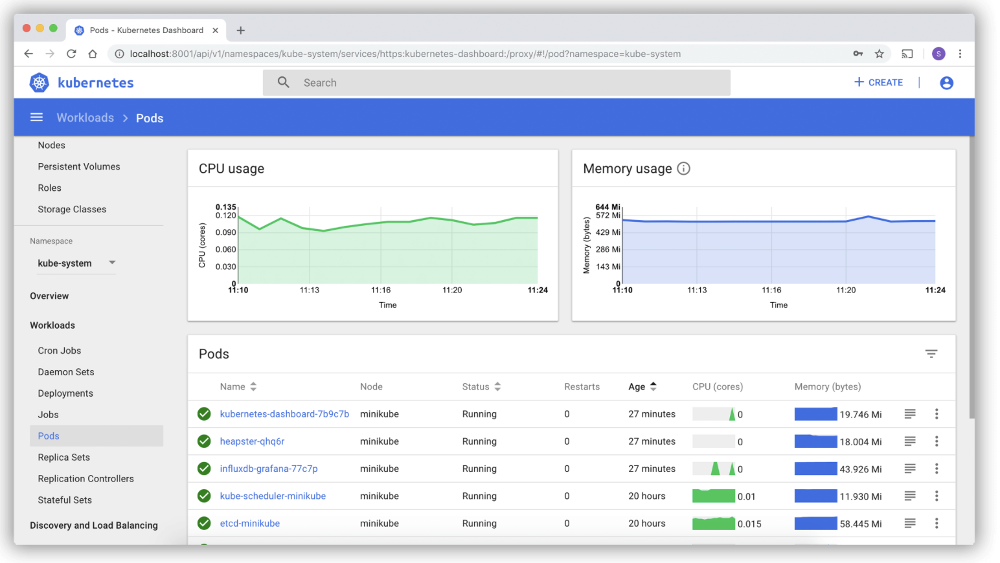
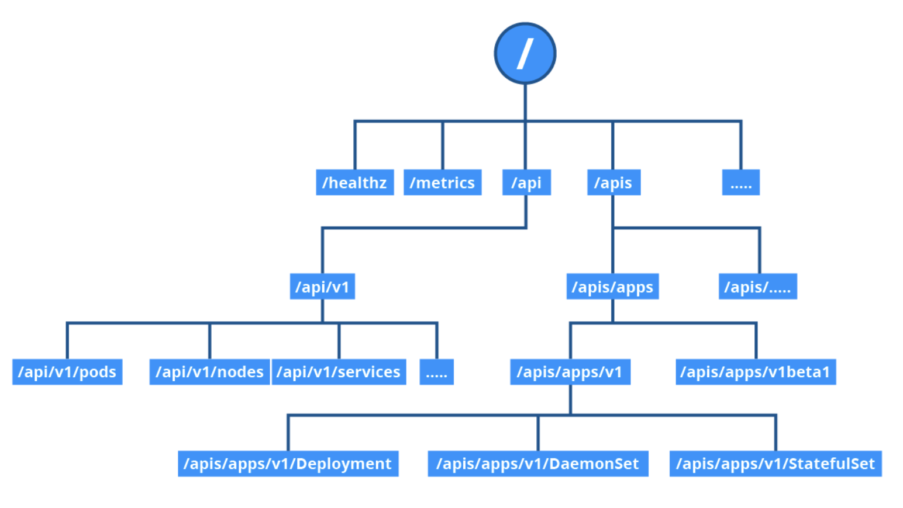

# Accessing minikube


## CLI tools and scripts

- [`kubectl`](https://kubernetes.io/docs/reference/kubectl/) is the CLI client to manage kubernetes cluster resources and applications
- Can be used as a standalone tool or integrated with other scripts and automation tools
- Configure credentials and cluster access points to use it from anywhere

### Installation

> Linux installation instructions

Download and install the latest stable `kubectl` binary

```shell
$ curl -LO "https://dl.k8s.io/release/$(curl -L -s \
  https://dl.k8s.io/release/stable.txt)/bin/linux/amd64/kubectl"

$ sudo install -o root -g root -m 0755 kubectl /usr/local/bin/kubectl
```

Verify installation with

```shell
$ kubectl version --client
```

A typical helpful post-installation configuration is to enable [shell autocompletion](https://kubernetes.io/docs/tasks/tools/install-kubectl-linux/#enable-shell-autocompletion) for `kubectl`

> MacOS installation instructions

Method 1: manually install the latest stable binary and move it to `PATH`

```shell
$ curl -LO "https://dl.k8s.io/release/$(curl -L -s \
  https://dl.k8s.io/release/stable.txt)/bin/darwin/amd64/kubectl"

$ chmod +x ./kubectl

$ sudo mv ./kubectl /usr/local/bin/kubectl

$ sudo chown root: /usr/local/bin/kubectl
```

Method 2: use the [Homebrew package manager](https://brew.sh/) by issuing the following command

```shell
$ brew install kubectl
```

Verify installation with

```shell
$ kubectl version --client
```

> Windows installation instructions

Install manually by downloading the latest stable binary and moving it to `PATH`

```powershell
> curl -LO "https://dl.k8s.io/release/v1.25.4/bin/windows/amd64/kubectl.exe"
```

Verify the installation with

```powershell
> kubectl version --client
```

### Configuration

- `kubectl` configuration is located at `~/.kube/` and is named `config`
- Contains cluster connection details (control plane's endpoint and required credentials)
- Multiple configurations can exist for a single client
- The configuration can be dumped to stdout with `$ kubectl config view`
- Cluster information can be displayed with `$ kubectl cluster-info`

## Web UI

- The [Kubernetes Dashboard](https://kubernetes.io/docs/tasks/access-application-cluster/web-ui-dashboard/) provides a web UI to interact with a kubernetes cluster
- Not as flexible as `kubectl`, but good for users who are not comfortable with CLI tools



### Activation

- `minikube` installs the kubernetes dashboard as an add-on, but it is disabled by default
- To activate the dashboard, we'll need to enable the following add-ons
    - The dashboard add-on
    - The metrics server add-on (helper that collect usage metrics from the kubernetes cluster)
- Enable the required add-ons by running the following

```shell
$ minikube addons enable metrics-server

$ minikube addons enable dashboard

$ minikube addons list
```

### Access

- Access the dashboard through a web browser with the following command

```shell
$ minikube dashboard
```

- If a new browser tap does not open automatically, copy and paste the URL from the following command instead

```shell
$ minikube dashboard --url
```

## APIs for programmatic access

- The control plane runs an API server responsible for exposing kubernetes APIs
- Allows direct interaction with a cluster (usable by both CLI tools and the Dashboard UI)
- Accessible through its endpoints to those possessing the required credentials



The API can be divided into 3 independent group types

1) Core group (`/api/v1`) includes objects such as Pods, Services, Nodes, Namespaces, ConfigMaps, Secrets, etc
2) Named group (`/apis/$NAME/$VERSION`) provides API versioning to imply different levels of support and stability
    - *Alpha level*: may be dropped at any time, potentially without notice
    - *Beta level*: well-tested, but semantics may change in incompatible ways in subsequent releases
    - *Stable level*: appears in released software for many subsequent versions
3) System wide group that consists of endpoints like `/healthz`, `/logs`, `/ui`, `/metrics`, etc

### APIs with proxy

- The `kubectl proxy` command authenticates with the API server on the control plane node and makes services available on the default proxy port 8001
- With the proxy running, API requests can be sent over `localhost:8001`

### APIs with authentication

- When not using `kubectl proxy`, we must authenticate when sending API requests
- This is done by providing a set of keys and certificates as a **Bearer Token**
- Tokens can be generated at the clients request as follows

```shell
$ export TOKEN=$(kubectl create token default)

$ kubectl create clusterrole api-access-root \
  --verb=get --non-resource-url=/*

$ kubectl create clusterrolebinding api-access-root \
  --clusterrole api-access-root --serviceaccount=default:default
```

- Retrieve the API server endpoint, it should match the IP address as the `kubectl cluster-info` command has

```shell
$ export APISERVER=$(kubectl config view | grep https | \
  cut -f 2- -d ":" | tr -d " ")
```

- Access the API server with the token generated earlier

```shell
$ curl $APISERVER --header "Authorization: Bearer $TOKEN" --insecure
```

- Instead of a token, we can encode the client certificate, client key, and certificate authority data from `~/.kube/config`

```shell
curl $APISERVER --cert $(encoded-cert) --key $(encoded-key) --cacert $(encoded-ca)
```
