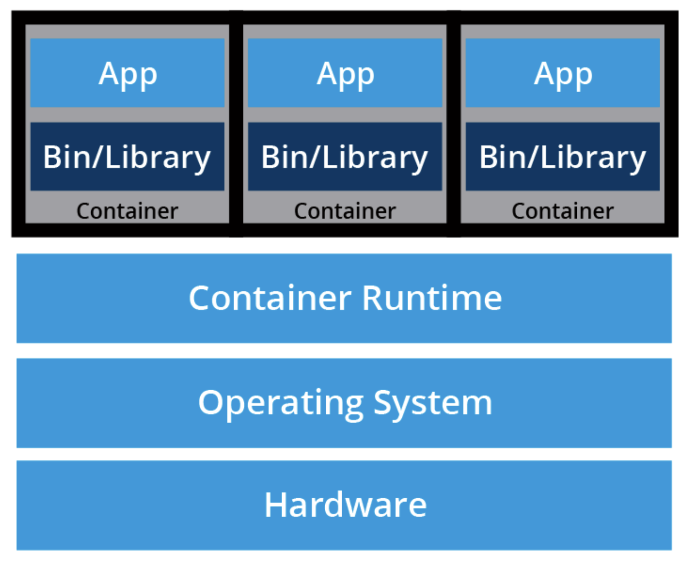

# Container orchestration

## What are containers?

**Containers** are an application-centric method to deliver high-performing, scalable applications on any infrastructure of your choice. Containers are best suited to deliver microservices by providing portable, isolated virtual environments for applications to run without interference from other running applications.

**Microservices** are lightweight applications written in various modern programming languages, with specific dependencies, libraries and environmental requirements. To ensure that an application has everything it needs to run successfully it is packaged together with its dependencies.

> Containers encapsulate microservices and their dependencies but do not run them directly. Containers run container images.

A **container image** bundles the application along with its runtime, libraries, and dependencies, and it represents the source of a container deployed to offer an isolated executable environment for the application. Containers can be deployed from a specific image on many platforms, such as workstations, Virtual Machines, public cloud, etc.

## What is container orchestration?

Running containers on a single host during development is suitable in most cases, but does not meet requirements of production 

- Fault-tolerance
- On-demand scalability
- Optimal resource usage
- Auto-discovery to automatically discover and communicate with each other
- Accessible from the outside world
- Seamless updates/rollbacks without any downtime

**Container orchestrators** are tools which group systems together to form clusters where containers' deployment and management is automated at scale while meeting the requirements mentioned above.

### Container orchestrators

Moving applications to the cloud has created a demand for tooling in container orchestration.

| Orchestrator   | Provider    |
|--------------- | --------------- |
| Amazon elastic container service | Amazon Elastic Container Service (ECS) is a hosted service provided by [Amazon Web Services (AWS)](https://aws.amazon.com/) to run containers at scale on its infrastructure. |
| Azure container instances | Azure Container Instance (ACI) is a basic container orchestration service provided by [Microsoft Azure](https://azure.microsoft.com/en-us/). |
| Azure service fabric | Azure Service Fabric is an open source container orchestrator provided by [Microsoft Azure](https://azure.microsoft.com/en-us/). |
| Kubernetes | Kubernetes is an open source orchestration tool, originally started by Google, today part of the [Cloud Native Computing Foundation (CNCF)](https://www.cncf.io/) project. |
| Marathon | Marathon is a framework to run containers at scale on [Apache Mesos](https://mesos.apache.org/) and [DC/OS](https://dcos.io/). |
| Nomad | Nomad is the container and workload orchestrator provided by [HashiCorp](https://www.hashicorp.com/). |
| Docker swarm | Docker Swarm is a container orchestrator provided by [Docker, Inc.](https://www.docker.com/) It is part of [Docker Engine](https://docs.docker.com/engine/). |

### Why use an orchestrator?

Manually coupling a few containers and writing a few scripts to automate their lifecycles is doable, it does not work so well when working with hundreds or thousands of containers running on global infrastructure. Orchestrators allows us to: 

- Group hosts together while creating a cluster.
- Schedule containers to run on hosts in the cluster based on resources availability.
- Enable containers in a cluster to communicate with each other regardless of the host they are deployed to in the cluster.
- Bind containers and storage resources.
- Group sets of similar containers and bind them to load-balancing constructs to simplify access to containerized applications by creating an interface, a level of abstraction between the containers and the client.
- Manage and optimize resource usage.
- Allow for implementation of policies to secure access to applications running inside containers.

With all these configurable yet flexible features, container orchestrators are an obvious choice when it comes to managing containerized applications at scale. In this course, we will explore Kubernetes, one of the most in-demand container orchestration tools available today.

## Deploying the orchestrator

- Can be deployed on the infrastructure of our choice
    - Bare metal
    - Virtual machines
    - On-premises
    - Public or hybrid clouds
- Solutions for immediately installing orchestrators are provided by infrastructure-as-a-service providers
- Solutions for managed container orchestration, also known as orchestration-as-a-service
