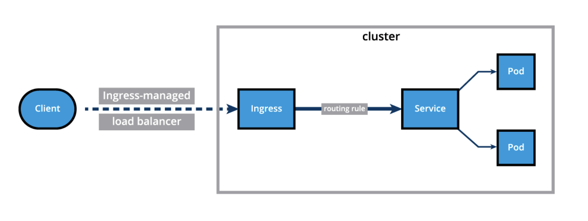

# Ingress

## What is ingress?

Ingress decouples the routing rules from the application and centralizes rule management. This means applications can be updated without worrying about external access. To allow external access, **ingress resources** provide the following

- Configures layer 7 HTTP/HTTPS load balancer
- Transport layer security (TLS)
- Name-based virtual hosting
- Fanout routing
- Load balancing
- Custom rules



With an **ingress service**, users do *not* connect to services directly. Instead, they connect to the ingress endpoint and the request is forwarded to the desired service. An example of an ingress definition using **name-based virtual hosting** is given below

```yaml
apiVersion: networking.k8s.io/v1 
kind: Ingress
metadata:
  annotations:
    kubernetes.io/ingress.class: "nginx"
  name: virtual-host-ingress
  namespace: default
spec:
  rules:
  - host: blue.example.com # Requests to this host are forwarded from the ingress endpoint
    http:
      paths:
      - backend:
          service: # The service the ingress endpoint forwards to
            name: webserver-blue-svc
            port:
              number: 80
        path: /
        pathType: ImplementationSpecific
  - host: green.example.com # Requests to this host are forwarded from the ingress endpoint
    http:
      paths:
      - backend:
          service: # The service the ingress endpoint forwards to
            name: webserver-green-svc
            port:
              number: 80
        path: /
        pathType: ImplementationSpecific
```

Ingress services can be configured to **fanout** based on the URI of a request. An example of such an ingress service is given below

```yaml
apiVersion: networking.k8s.io/v1
kind: Ingress
metadata:
  annotations:
    kubernetes.io/ingress.class: "nginx"
  name: fan-out-ingress
  namespace: default
spec:
  rules:
  - host: example.com
    http:
      paths:
      - path: /blue # Forwards requests to example.com/blue
        backend:
          service:
            name: webserver-blue-svc
            port:
              number: 80
        pathType: ImplementationSpecific
      - path: /green # Forwards requests to example.com/green
        backend:
          service:
            name: webserver-green-svc
            port:
              number: 80
        pathType: ImplementationSpecific
```

> The Ingress resource does not do any request forwarding by itself, it merely accepts the definitions of traffic routing rules. The ingress is fulfilled by an Ingress Controller, which is a reverse proxy responsible for traffic routing based on rules defined in the Ingress resource.

## Ingress controllers

Ingress controllers are applications that watch the control plane node's API server for changes in the ingress resources and updates the layer 7 load balancing accordingly. Kubernetes supports an array of ingress controllers and, if needed, can build your own. 

In order to ensure that the ingress controller is watching its corresponding ingress resource, the ingress resource definition manifest needs to include an ingress class annotation with the name of the desired controller kubernetes.io/ingress.class: "nginx" (for an nginx ingress controller).

### Deploy an ingress resource

Once an ingress controller is deployed, simply use the `kubectl create` command to create an ingress resource

### Accessing resources with ingress

With the ingress resource active, we should be able to access the specified services using the URLs given to the ingress resource. Just make sure that the DNS records to find the ingress endpoint are accurate.
