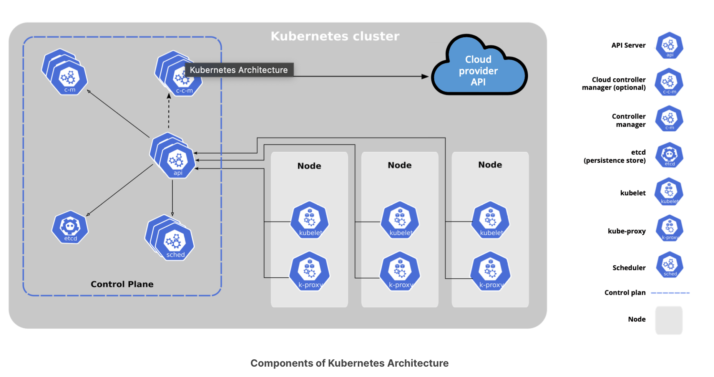

# Kubernetes architecture

## The architecture

- One or more **control plane** nodes
- One or more **worker** nodes (optional)

### Control plane

#### Overview

- The **control plane** node provides a running environment for **control plane agents** responsible for managing a state of a Kubernetes cluster
  - It is the brain behind all operations in the cluster
  - Components are agents with very distinct roles in the cluster
  - Communication with a cluster is done by sending requests to the control plane
- The control plane must be kept running at all costs or else downtime may be introduced
  - To ensure tolerance, control plane replicas can be added to a cluster
  - Only one control plane actively manages the cluster, but components stay synced across all replicas
- To preserve cluster state, all cluster configuration data is saved in a distributed key-value store
  - No client workload data is saved here
  - The store can be configured on the control plane node (stacked topology) or on a dedicated host (external topology)

#### Components

A control plane node runs the following essential agents

- API server
- Scheduler
- Controller managers
- Key-value data store

Additionally, control plane nodes can run 

- The container runtime
- Node agent
- Proxy
- Optional add-ons for cluster-level monitoring and logging

##### API server

- Handles all administrative tasks
- Intercepts RESTful calls from users, adminstrators, developers, operators and external agents, then validates and processes them
- Reads the current state from the key-value store during processing and stores resulting state to the key-value store afterwards
- The **only** control plane component to talk (read and write) to the key-value store holding the cluster state information
- Server is highly configurable and customizable
  - Can scale horizontally
  - Supports the addition of secondary API servers
  - Add custom API servers

##### Scheduler

- Assigns new workload objects to other nodes (typically worker nodes)
- Obtains the following from the key-value store (via the API server)
  - Resource usage data for each worker node
  - New workload object's requirements and configuration data
- Scheduler must account for
  - Quality of service (QoS) requirements
  - Data locality
  - Affinity and anti-affinity
  - Taints and toleration and cluster topology
- Scheduler algorithm
  1) Filter nodes with predicates to isolate possible node candidates
  2) Candidates are scored with a priority in order to select the 1 node that satisfies all requirements of the new workload
  3) Outcome of decision process is communicated back to the API server, which then delegates and update the state
- Scheduler is highly configurable and customizable
  - Scheduling policies, plugins and profiles can influence decisions made
  - Can utilize a completely custom scheduler instead(overall or on a per-object basis)

##### Control managers

- Run controller or operator processes to regulate the state of the cluster
- Execute continuously in a watch-loop process
  1) Read clusters **desired** state (from objects' configuration data)
  2) Compare with **current** cluster state (from key-value store obtained via API server)
  3) Take corrective action if needed until current state matches desired state
- `kube-controller-manager` runs controller or operators responsible to act when nodes become unavailable
- `cloue-controller-manager` runs controller or operators responsible to interact with underlying infrastructure of a cloud provider

##### Key-value store

- `etcd` is a consistent, distributed **key-value store** used to persist kubernetes cluster states
- New data with *appended only*, never replaced, but obsolete data is discarded periodically
- Only the API server interacts directly with the key-value store
- `etcdctl` (CLI for `etcd`) provides save and restore capabilities which is good for development or learning environments
- In production, data stores should be replicated in high availability mode for cluster configuration resiliency

### Worker nodes

#### Overview

- A **worker node** provides a running environment for client applications
- These client applications are microservices running as application containers
- Application containers are encapsulated by a pod, which is controlled by the cluster control plane
- Pods are scheduled on worker nodes, where appropriate compute, memory, and storage resources are available and networking to setup internal and external communication
- A pod is the smallest scheduling work in kubernetes, representing a logical collection of one or more application containers that can be started, stopped, or rescheduled as a single unit
- Network traffic between users and containerized applications is handled directly by the pods, not the control plane node

#### Components

A worker node has the following components

- Container runtime
- Node agent
- Proxy
- Add-ons for DNS, dashboard UI, and cluster-level monitoring and logging

##### Container runtime

- Kubernetes cannot handle and run containers itself; it requires a separate container runtime
- Runtimes are required on all nodes of a kubernetes cluster
- The following runtimes are supported by kubernetes
  - [CRI-O](https://cri-o.io/): a lightweight container runtime for kubernetes
  - [`containerd`](https://containerd.io/): simple, robust, and portable container runtime
  - [Docker Engine](https://www.docker.com/): A popular and complex container platform that used `containerd`
  - [Mirantis Container Runtime](https://www.mirantis.com/software/container-runtime/): formally known as **docker enterprise edition**

##### Node agent

- Runs on each and every node (worker and control plane nodes)
  - Communicates with the control plane
  - Receives pod definitions primarily from the API server
  - Monitors the health and resources of pods running containers
- Connects to container runtimes through the [Container Runtime Interface (CRI)](https://github.com/kubernetes/community/blob/master/contributors/devel/sig-node/container-runtime-interface.md)
  - Consists of protocol buffers, gRPC API, libraries, and additional specification and tools
  - To support interchangeable container runtimes, a CRI shim (application with an abstraction layer) is placed between the node agent and container runtime

##### CRI shims

- Agents originally only supported the docker engine through a unique interface model
- Container runtime integration was standardized with the CRI, meaning any runtime that implements CRI can be used with kubernetes
- Shims are CRI implementations, or adapters, specific to each container runtime

##### Proxy

- The network agent running on each node
- Is responsible for dynamic updates and maintenance of all networking rules on the node
- Abstracts details of pod networking and forwards connections to containers in the pod

##### Add-ons

- **DNS**: Cluster DNS is a DNS server required to assign DNS records to Kubernetes objects and resources.
- **Dashboard**: A general purpose web-based user interface for cluster management.
- **Monitoring**: Collects cluster-level container metrics and saves them to a central data store.
- **Logging**: Collects cluster-level container logs and saves them to a central log store for analysis.

## Networking challenges

> Decoupled microservices based applications rely heavily on networking in order to mimic the tight-coupling once available in the monolithic era. Networking, in general, is not the easiest to understand and implement. Kubernetes is no exception.

### Container-to-container communication

- Container runtimes create isolated network spaces for each container that is started
- Spaces may be shared across containers or with the host operating systems
- A **pause container** is initialized by the container runtime for the sole purpose of creating a network space
- All additional containers share the **pause container's** network space so that they are all reachable via localhost

### Pod-to-pod communication across nodes

- Cluster pods and scheduled in an unpredictable fashion
  - Regardless of host node, pods must be able to communicate will all other pods in the cluster
  - This must be done without implementing *network address translation* (NAT)
- To reduce complexity, pods are treated as VMs on a network
  - Each virtual machine is equipped with a network interface, thus receiving a unique IP address
  - This "**IP-per-pod**" model ensure pod-to-pod communication
- Containers must coordinate assigned ports inside a pod just as applications would on a VM
  - Containers are integrated with the overall networking model with a [Container Networking Interface](https://github.com/containernetworking/cni)
  - CNIs are a set specifications and libraries which allow plugins to configure the networking for containers.
  - Most CNI plugins are 3rd party software defined networking solutions implementing the kubernetes networking model

### External-to-pod communication

> A successfully deployed containerized application running in Pods inside a Kubernetes cluster may require accessibility from the outside world. Kubernetes enables external accessibility through **Services**, complex encapsulations of network routing rule definitions stored in **iptables** on cluster nodes and implemented by `kube-proxy` agents. By exposing services to the external world with the aid of `kube-proxy`, applications become accessible from outside the cluster over a virtual IP address and a dedicated port number.
