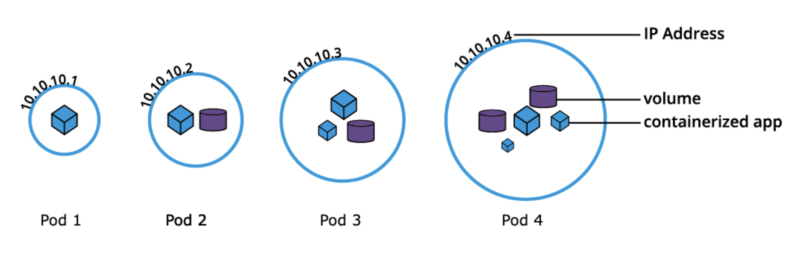
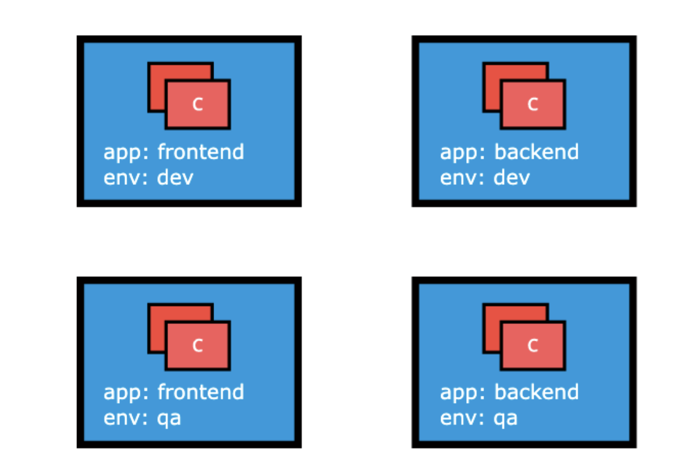
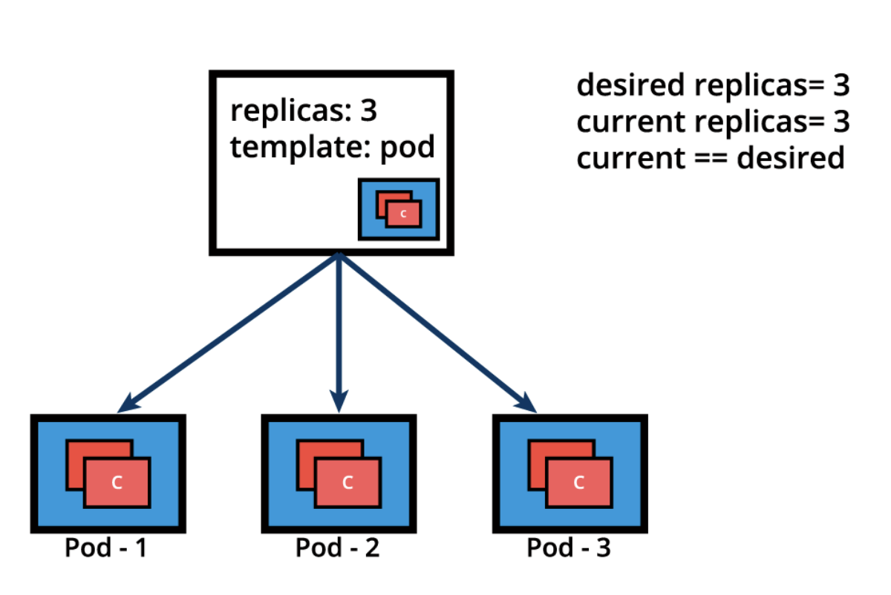

# Kubernetes building blocks

## Kubernetes object model

Kubernetes implements a rich object model to assist with advanced application lifecycle management. Different persistent entities can be represented in a kubernetes cluster

- What containerized applications are running
- The nodes where containerized applications are deployed
- Application resource consumption
- What policies are attached to applications

For each object, a `spec` section declared the desired state of the object while the `status` section records the actual status of the object. The kubernetes system (control plane) attempts the match the actual state to the desired state.

### Nodes

- Nodes are virtual identities assigned by kubernetes to systems that are part of a cluster
- Each node is managed by 2 node agents while hosting a container runtime to run containerized workloads
- A node can be
  - A control plane (typically 1 per cluster, but multiple can be made if high availability is required)
  - A worker node (typically one or more per cluster to run containerized applications and provide resource redundancy)
- Node identities are created and assigned during the cluster bootstrapping process by the tool responsible to initialize the cluster agents
  - `minikube` uses `kubeadm` to initialize a control plane in the **init** phase
  - `minikube` grows a cluster by adding addition nodes in the **join** phase

### Namespaces

- Clusters can be partitioned into virtual sub-clusters using **namespaces**.
  - Names of resources/objects are unique within a namespace, but not across namespaces in the same cluster
  - Listing namespaces in a cluster can be done with: `$ kubectl get namespaces`
- Kubernetes creates the following namespaces by default
  1) `kube-system`: contains objects created by the kubernetes system (typically control plane agents)
  2) `default`: contains objects/resources created by administrators and developers (object assigned here if no namespace is provided)
  3) `kube-public`: an unsecured, publicly readable namespace used for exposing non-sensitive information about a cluster
  4) `kube-node-lease`: holds node lease objects used for node heartbeat data
- Good practice is to create additional namespaces as desired, virtualizing the cluster and isolating different users
- Resource quotas can help limit overall resource consumption within a namespace
- Limit ranges help limit container resource consumption and their enclosing objects in a namespace

### Pods

- A pod is the smallest kubernetes workload object (the unit of deployment in kubernetes, representing a single instance of an application)
- Pods are logical collections of 1 or more containers, enclosed and isolated to ensure
  - They are scheduled together on the same host
  - They share the same network namespaces (sharing a single IP address)
  - They have access to mount the same external storage and other common dependencies



- Pods are ephemeral and do *not* repair themselves
- Controllers/operators handle pod replication, fault-tolerance, and recovery
- When managing an application, the pod specification is nested in the controller's definition

```yaml
apiVersion: v1 # REQUIRED for pod object definition
kind: Pod
metadata: # Holds object name and optional labels and annotations
  name: nginx-pod
  labels:
    run: nginx-pod
spec: # Defines the desired state of the pod
  containers: # Create a single container
  - name: nginx
    image: nginx:1.22.1 # Running this image pulled from a container registry
    ports:
    - containerPort: 80 # Exposing this port for inter-application access or external access
```
## Labels

- Labels are **key-value** pairs attached to a kubernetes object
- They are used to organize and select a subset of pods
- Many objects can have the same label(s), meaning they do **not** provide uniqueness
- Controllers used labels to logically group together decoupled objects



- The image above shows 2 labels in use: `app` and `env`
  - There are 4 pods in this example cluster, each pod having a value for each respective label
  - Label `env=dev` groups the top 2 pods
  - Label `app=frontend` groups the left 2 pods
  - Labels `app=frontent` **AND** `env=qa` selects the bottom-left pod

### Selectors

- **Equality-based**: filter objects based on label and key values where matching is achieved using `==` or `!=` operators
- **Set-based**: filter objects based on a set of values where `in` and `not in` match label values and `exist` and `does not exist` match label keys

## Operators and controllers

### Replication controllers

A complex operator that

- Ensures a specified number of replicas of a pod is running at any given time
- Constantly compares actual and desired state of the managed application

If there are more Pods than the desired count, the replication controller randomly terminates the number of Pods exceeding the desired count, and, if there are fewer Pods than the desired count, then the replication controller requests additional Pods to be created until the actual count matches the desired count.

### Replica sets

Essentially the modern implementation of replication and self-healing aspects of replication controllers. Includes additional support for set-based label selectors whereas replication controllers *only* support equality-based selectors.

- An application or host running an application may crash unexpectedly
- If only a single application instance exists, other applications, services, or clients may be adversely affected
- To avoid possible failures, multiple instances of the application are run in parallel, thereby achieving high availability
- Application lifecycles are overseen by a controller and the number of pods can be scaled manually or automatically



- If one of the pods unexpectedly terminates, the replica set detects the current state no longer matches the desired state
- A request for an additional pod to be created is sent, ensuring the current state matches the desired state
```yaml
apiVersion: apps/v1
kind: ReplicaSet
metadata:
  name: frontend
  labels:
    app: guestbook
    tier: frontend
spec:
  replicas: 3
  selector:
    matchLabels:
      app: guestbook
  template:
    metadata:
      labels:
        app: guestbook
    spec:
      containers:
      - name: php-redis
        image: gcr.io/google_samples/gb-frontend:v3
```

- Replica sets can be used independently as pod controllers, but only offer a limited set of features
- The more practical option is deployments, which also manages creation, deletion, and updates to pods

### Deployments

- Provide declarative updates to pods and replica sets by ensuring that the current state always matches the desired state of our running containerized application
- Allows for seamless application updates and rollbacks with multiple update strategies
  - **Rolling update**: through `rollouts` and `rollbacks`, replica set is directly managed for application scaling
  - **Recreate**: a less popular, more disruptive update strategy

```yaml
apiVersion: apps/v1 # REQUIRED for deployments
kind: Deployment
metadata: # Holds basic object information (names, annotations, labels, namespaces)
  name: nginx-deployment
  labels:
    app: nginx-deployment
spec: # Defines desired state of **deployment** object
  replicas: 3
  selector:
    matchLabels:
      app: nginx-deployment
  template: # Defines desired state of **pods** part of this deployment
    metadata:
      labels:
        app: nginx-deployment
    spec:
      containers:
      - name: nginx
        image: nginx:1.20.2
        ports:
        - containerPort: 80
```

The example above creates the following as "revision 1"

- `ReplicaSet A`
- 3 pods configured to run the `nginx:1.20.2` container image

To update the container image from `nginx:1.20.2` to `nginx:1.21.5`, the following occurs to make "revision 2"

1) `ReplicaSet B` is created for the new container image version
2) `ReplicaSet A` is *scaled down* to 0 pods while `ReplicaSet B` is *scaled up* to 3 pods
3) When new pods are ready, they are actively managed by the deployment while the previous state "revision 1" is saved to support rollbacks

### Daemon sets

- Designed to manage node agents, they resemble replica sets of deployments *when* managing multiple pod replicas and application updates
- Has the distinct feature to enforce single pod replica per node, on all nodes
- Common use cases
  - Monitoring data from all nodes
  - Run storage, networking, or proxy daemons on all nodes
  - Ensure a specific type of pod is running on all nodes
- New nodes are given a pod from a daemon set automatically
- Exiting nodes have the pods given from a daemon set garbage collected
- If a daemon set is deleted, all pod replicas created are deleted as well
- Daemon set pods are placed on nodes by the controller itself (without the scheduler)
  - Placement still governed by scheduling properties, which may limit the nodes a pod can be place in
  - To further limit, scheduling properties such as selectors, affinity rules, taints and tolerations can ensure daemon sets only place pods on specific nodes

```yaml
apiVersion: apps/v1
kind: DaemonSet
metadata:
  name: fluentd-agent
  namespace: kube-system
  labels:
    k8s-app: fluentd-agent
spec:
  selector:
    matchLabels:
      k8s-app: fluentd-agent
  template:
    metadata:
      labels:
        k8s-app: fluentd-agent
    spec:
      containers:
      - name: fluentd-agent
        image: quay.io/fluentd_elasticsearch/fluentd:v2.5.2
```
