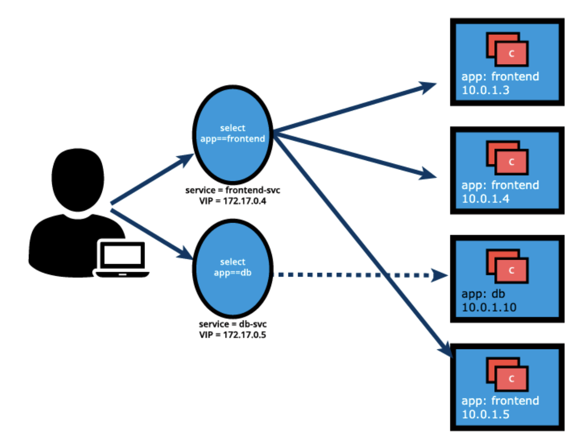

# Services

## Connecting to applications or pods

- To access applications, users or other applications need to connect to pods
- Pods are ephemeral in nature, resources cannot be allocated to them statically
- A pod that is abruptly terminated will be recreated with by a controller with a different IP address that is not immediately known
- To overcome this, kubernetes provides the `Service` abstraction to logically group pods and define a policy to access them
  - Grouping is achieves with labels and selectors
  - Named groupings are referred to as **services**, which is also registered in a cluster's internal DNS
  - Services can expose single pods, replica sets, deployments, daemon sets, and stateful sets

### Service object

```yaml
apiVersion: v1
kind: Service
metadata:
  name: frontend-svc
spec:
  selector:
    app: frontend
  ports:
  - protocol: TCP
    port: 80
    targetPort: 5000
```

In the example above, a service named `frontend-svc` is created as follows

1) Select the pods with labels: `app=frontend`
2) Service receives an IP address routable only inside the cluster (known as a `ClusterIP`)



3) User or client connects to `frontend-svc` via its `ClusterIP`
4) Service forwards traffic to one of the pods attached to it, providing load balancing when selecting which pod to forward to

A `targetPort` can be chosen to forward traffic to on the selected pod. If no port is specified, traffic is forwarded to the same port that the service receive it from. It is *very* important to ensure the `targetPort` on the service spec matches `containerPort` on the pod spec.

A logical set of pod IP addresses with the `targetPort` is referred to as the **service endpoint**. The `frontend-svc` from above has the following endpoints

1) `10.0.1.3:5000`
2) `10.0.1.4:5000`
3) `10.0.1.5:5000`

Endpoints are created and managed by the service object, not the kubernetes cluster administrator.

### `kube-proxy`

- A daemon process run on every node is the cluster
- Watches the API server on the master node for addition, updates, and removal of services and endpoints
- Responsible for implementing the service configuration on behalf of an administrator or developer


- Configures `iptables` rules to capture traffic for its `ClusterIP` and forward it to one of the service's endpoints
- *Any* node can receive external traffic and route it internally in the cluster based on the `iptables` rules
- When a service is removed, `kube-proxy` removes the corresponding `iptables` rules as well

### Traffic policies

- `kube-proxy` and `iptables` implement the load balancing mechanism of a service
- Due to restricting characteristics of `iptables`, load balancing is random
  - Endpoint pod to receive the request is randomly selected out of many replicas
  - The selected pod is **not** guaranteed to be the closest of same pod as the requester
  - To make better selection, traffic policies can overrule the `iptables` based load balancing
- Traffic policies instruct the `kube-proxy` on the context of traffic routing
  1) Cluster option: target all ready endpoints of the service in the load balancing process
  2) Local option: isolate the load balancing process to endpoints of the service that are located on the same node as the requester
- While the latter may seem ideal, if no endpoint on the same node is ready, request **will not** be routed to other nodes
- Both policies are available for internally generated requests from within the cluster, or clients and applications from outside the cluster

### Service discovery

Services are the primary mode of communication between containerized applications managed by Kubernetes. It is helpful to be able to discover them at runtime. Kubernetes supports 2 methods for discovering services.

#### Environment variables

- On pod start, `kubelet` adds a set of environment variables in the pod for all active services
- Ordering must be taken into account as pods will not have the environment variables set for services which are created after the pods are created

#### DNS

- Kubernetes has a DNS add-on that creates DNS records for each service in the form `my-svc.my-namespace.svc.cluster.local`
- Services within the same namespace can find each other by just their names
- Services from different namespaces can find each other by adding the respective namespace as a suffix or by providing the FQDN of the desired service

## Service Types

While defining a Service, we can also choose its access scope. We can decide whether the Service:

- Is only accessible within the cluster.
- Is accessible from within the cluster and the external world.
- Maps to an entity which resides either inside or outside the cluster.

Access scope is decided by `ServiceType` property, defined when creating the Service.

### ClusterIP

- The default service type; receives a virtual IP address known as is cluster IP address
- Accessible from only *within* the cluster

### NodePort

- In addition to a cluster IP address, receives a high-port (dynamically picked from 30000-32767)
- The specific service is mapped from all worker nodes
- A mapped port of 32233 for the `frontend-svc` service is reachable from any worker node on port 32233
- All nodes that receive traffic on port 32233 route it the assigned cluster IP address
- A specific high-port can be assigned when creating the service


This service type is useful for making services accessible from the outside world. End users can connect to *any* worker node of the specific high-port and requests are proxied internally to the ClusterIP of the service. Requests are then forwarded to the applications running inside the cluster (only 1 since the service also perform load balancing). Multiple services can be managed by configuring a reverse-proxy to target specific services within a cluster.

### LoadBalancer

- NodePort and ClusterIP are automatically created, and the external load balancer will route to them.
- The Service is exposed at a static port on each worker node.
- The Service is exposed externally using the underlying cloud provider's load balancer feature.


The LoadBalancer service type will only work if the underlying infrastructure supports the automatic creation of Load Balancers and have the respective support in Kubernetes, as is the case with the Google Cloud Platform and AWS. If no such feature is configured, the LoadBalancer IP address field is not populated, it remains in Pending state, but the Service will still work as a typical NodePort type service.

### ExternalIP

- Maps a service to an external IP address to route to one or more worker nodes
- Incoming traffic on the service port with the external IP address as its destination gets routed to one of the service endpoints
- Requires an external load balancer that is not part of the service cluster


### ExternalName

- A special service type that has no selectors and defines 0 endpoints
- When accessed from within the cluster, returns the `CNAME` record of an externally configured service
- Primary use case is to make externally configured services accessible from within the cluster

### Multi-port services

- A feature of service manifest to make configuration extremely flexible

```yaml
apiVersion: v1
kind: Service
metadata:
  name: my-service
spec:
  selector:
    app: myapp
  type: NodePort
  ports:
  - name: http
    protocol: TCP
    port: 8080
    targetPort: 80
    nodePort: 31080
  - name: https
    protocol: TCP
    port: 8443
    targetPort: 443
    nodePort: 31443
```

- The `my-service` service resource exposes pods with labels `app=myapp` with a container listening of port 80 or 443.
- Service is visible from within the cluster using its ClusterIP on ports 8080 and 8443
- Service is accessible from the external world using the NodePort URL on ports 31080 and 31443
