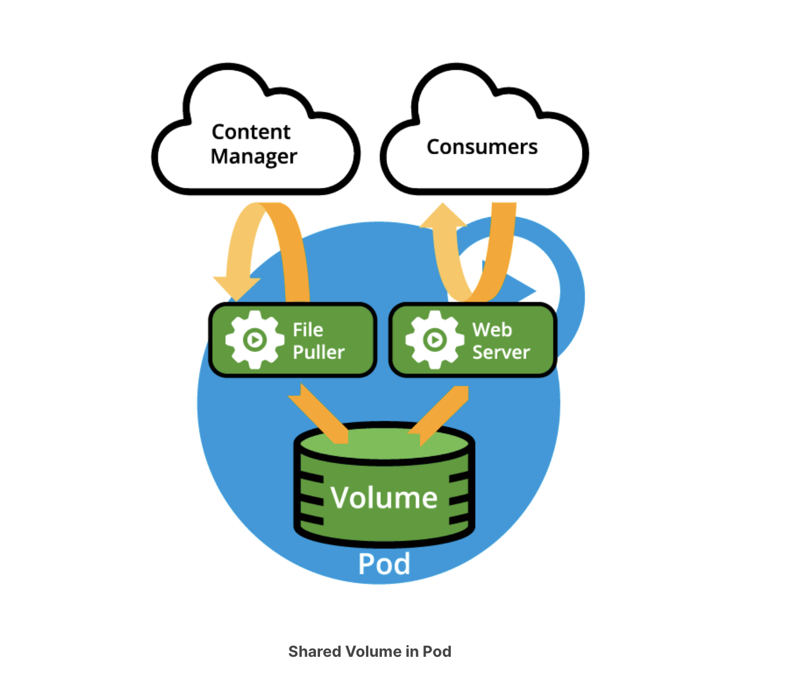
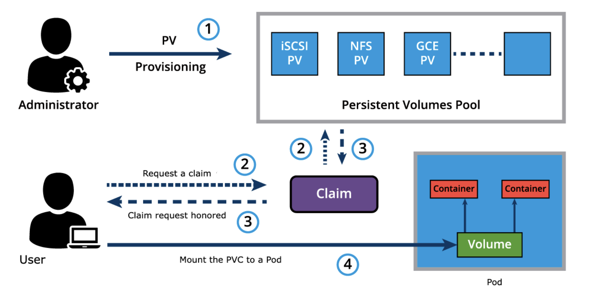

# Kubernetes volume management

## Kubernetes volumes

- Container data is deleted when it is destroyed (crashes, terminates, restarts, etc)
- `kubelet` will restart the container in a "clean" state without any previously stored data
- Volumes are a storage abstraction that allows kubernetes to offer various storage technologies to containers in pods
  - A volume is essentially a mount point on the container's file system backed by a storage medium
  - The storage medium, content and access mode are determined by the volume type
- Volumes are linked to a pod and can be shared among the container of that pod
- Volumes have the same lifespan as pods (meaning it is deleted together with the pod)
- Volumes outlive the containers of the pod they are linked to allowing data to be preserved across container restarts

### Volume types

A directory which is mounted inside a Pod is backed by the underlying Volume Type. A Volume Type decides the properties of the directory, like size, content, default access modes, etc. Some examples of Volume Types are:

- `emptyDir`: An empty Volume is created for the Pod as soon as it is scheduled on the worker node. The Volume's life is tightly coupled with the Pod. If the Pod is terminated, the content of `emptyDir` is deleted forever.  
- `hostPath`: With the `hostPath` Volume Type, we can share a directory between the host and the Pod. If the Pod is terminated, the content of the Volume is still available on the host.
- `gcePersistentDisk`: With the `gcePersistentDisk` Volume Type, we can mount a [Google Compute Engine (GCE) persistent disk](https://cloud.google.com/compute/docs/disks/) into a Pod.
`awsElasticBlockStore`: With the `awsElasticBlockStore` Volume Type, we can mount an [AWS EBS Volume](https://aws.amazon.com/ebs/) into a Pod. 
- `azureDisk`: With `azureDisk` we can mount a [Microsoft Azure Data Disk](https://docs.microsoft.com/en-us/azure/virtual-machines/linux/managed-disks-overview) into a Pod.
- `azureFile`: With `azureFile` we can mount a [Microsoft Azure File Volume](https://github.com/kubernetes/examples/blob/master/staging/volumes/azure_file/README.md) into a Pod.
- `cephfs`: With `cephfs`, an existing [CephFS volume](https://ceph.io/ceph-storage/) can be mounted into a Pod. When a Pod terminates, the volume is unmounted and the contents of the volume are preserved.
- `nfs`: With `nfs`, we can mount an [NFS share](https://en.wikipedia.org/wiki/Network_File_System) into a Pod.
- `iscsi`: With `iscsi` we can mount an [iSCSI share](https://en.wikipedia.org/wiki/ISCSI) into a Pod.
- `secret`: With the `secret` Volume Type, we can pass sensitive information, such as passwords, to Pods.
- `configMap`: With `configMap` objects, we can provide configuration data, or shell commands and arguments into a Pod.
- `persistentVolumeClaim` We can attach a `PersistentVolume` to a Pod using a `persistentVolumeClaim`. 

### Container storage interface

- Container orchestrators used to manage external storage in their own way
- Became a challenge to manage different plugins
- Storage vendors and orchestrators worked together to standardize the volume interface

## `PersistentVolume` and `PersistentVolumeClaim` objects

A Persistent Volume is a storage abstraction backed by several storage technologies, which could be local to the host where the Pod is deployed with its application container(s), network attached storage, cloud storage, or a distributed storage solution. A Persistent Volume is statically provisioned by the cluster administrator. 

- Can be dynamically provisioned based on a `StorageClass` resource
- `StorageClass`es define provisioners and parameters to create a `PersistentVolume`

Using `PersistentVolumeClaims`, a user sends the request for dynamic `PersistentVolume` creation, which gets wired to the `StorageClass` resource. It is essentially a request for storage by a user. Volumes requests are based on storage class, access mode, size, and volume mode

- Available access modes
  1) `ReadWriteOnce`: read-write by a single node
  2) `ReadOnlyMany`: read-only by many nodes
  3) `ReadWriteMany`: read-write by many nodes
  4) `ReadWriteOncePod`: read-write by a single pod
- Volume modes
  1) File system: mount volumes into a pod's directory
  2) Block device: mount volumes as a raw block device

Once a suitable `PersistentVolume` is found, it is bound to a `PersistentVolumeClaim`.

After a successful bound, the `PersistentVolumeClaim` resource can be used by the containers of the Pod.

Once a user finishes its work, the attached `PersistentVolumes` can be released. The underlying `PersistentVolumes` can then be reclaimed (for an admin to verify and/or aggregate data), deleted (both data and volume are deleted), or recycled for future usage (only data is deleted), based on the configured `persistentVolumeReclaimPolicy` property.
